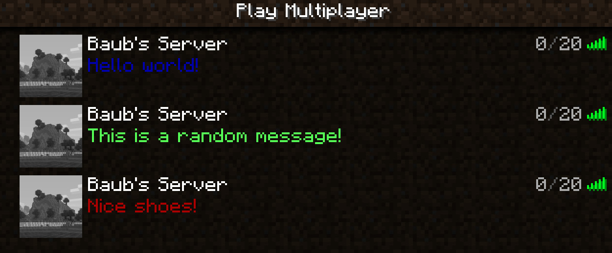

# SID

A small mod to set a random MOTD & custom brand on your server.

A new MOTD will be chosen every time the server is pinged.



The server brand is as seen in the F3 debug screen:


Install on your dedicated server.

Creates two new config files: `motd.txt` and `brand.txt`

Add a message on each line `motd.txt` to be chosen randomly. Supports [color codes](https://minecraft.fandom.com/wiki/Color) & `\n`
```
§1Hello world!
§aThis is a random message!
§4Nice shoes!
§dThis message spans \n multiple lines!
```

Add your custom brand on the first line of `brand.txt`
```
EPIC!
```