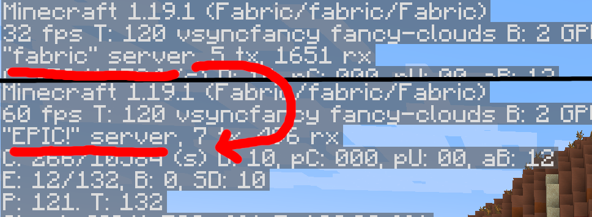

# SID by Ibraheem Rodrigues

A small mod to change the server brand, as seen in the F3/Debug menu

Install on your dedicated server.

Creates a file `brand.txt` next to `server.properties` and `eula.txt`.

Add your custom brand on the first line.